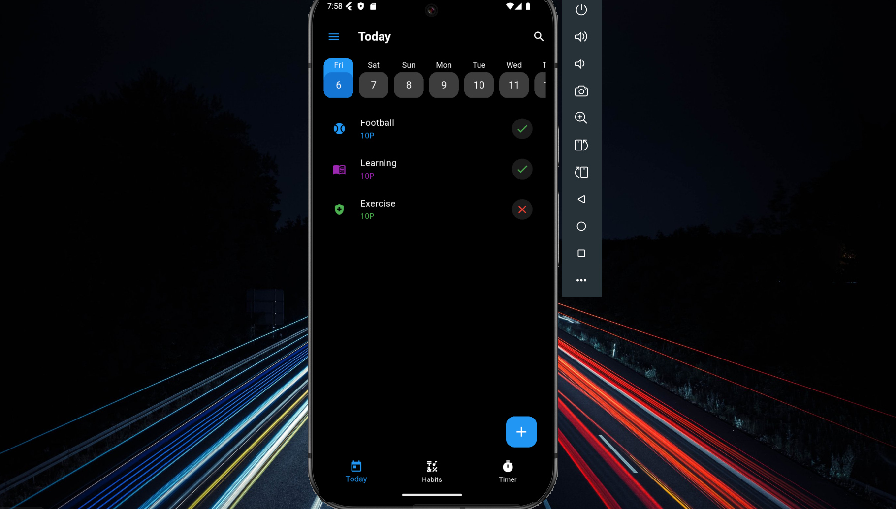
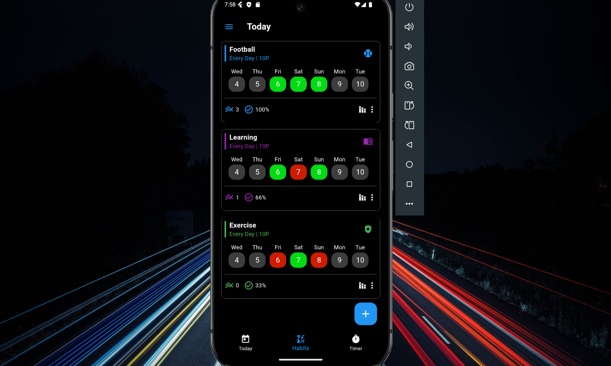
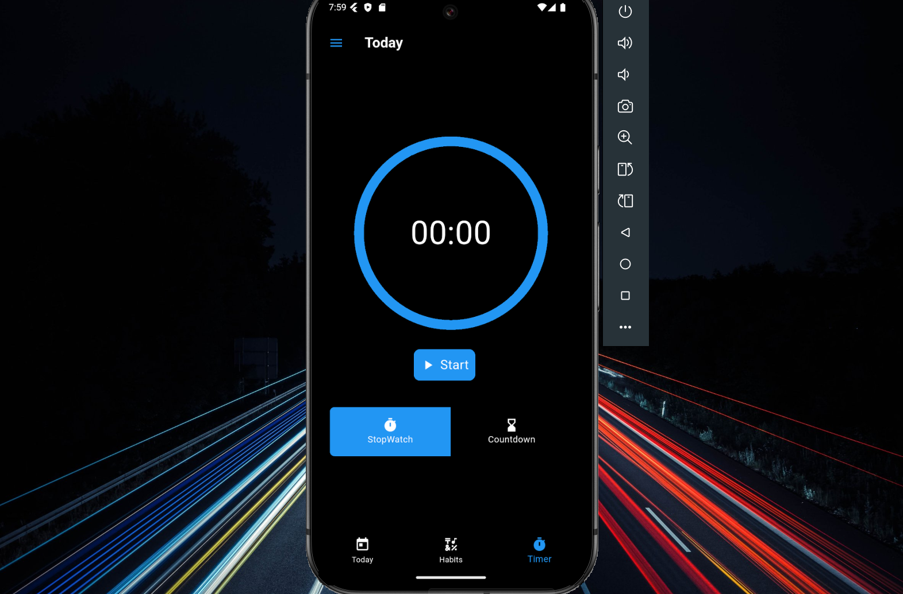
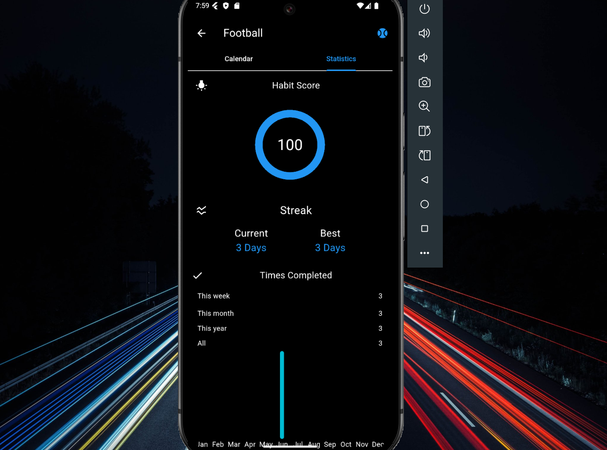
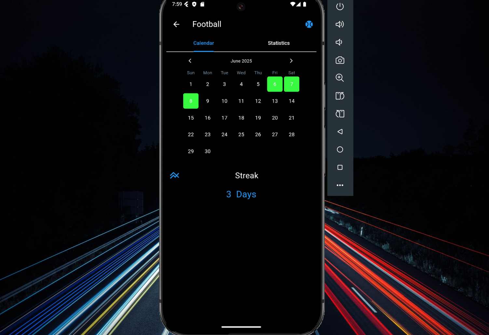

# 📊 Advanced Habit Tracker App

A feature-rich Flutter application designed to help users build better habits by tracking progress, setting reminders, and visualizing performance through interactive charts.

---

## 🔗 Links

- 🔗 **GitHub Repo:** [Habit Tracker on GitHub](https://github.com/salmanz64/Habit_Now)
- 🚀 **Hosted Link:** [Habit Tracker Hosted Link](https://habit-now-nu.vercel.app/)

## 📸 Screenshots

### 🔹 Home Page


### 🔹 Habit Details


### 🔹 Habit Timer


### 🔹 Habit Statistics


### 🔹 Habit Calendar



## 🛠 Tech Stack

- **Framework:** Flutter
- **Language:** Dart
- **State Management:** Provider
- **Database:** Hive
- **UI:** Custom widgets, Material Design
- **Packages:** 
  - `provider`
  - `fl_chart` *(for charts)*
  - `shared_preferences` *(for persistence)*

---

## 🚀 Features

### ✅ Core Functionality
- Add, edit, and manage custom habits
- Set daily/weekly reminders with time pickers
- Track daily progress using interactive checkboxes

### ⏳ Smart Behavior
- ⏱️ **Delay Enforcement**: If a habit is missed or not marked on time, the next opportunity is delayed. This encourages accountability and reduces "habit skipping."
- 🔁 Dynamic habit flow based on user performance

### 📊 Analytics
- Visualize progress and streaks using weekly/monthly charts
- Identify consistency and improvement areas through data

### 💡 User Experience
- Clean and minimal UI using Material Design
- Local or cloud sync for data persistence
- Dark/light mode 

---

## 📦 Getting Started

### 1. Clone the Repository
```bash
git clone https://github.com/salmanz64/Habit_Now.git
cd Habit_Now
